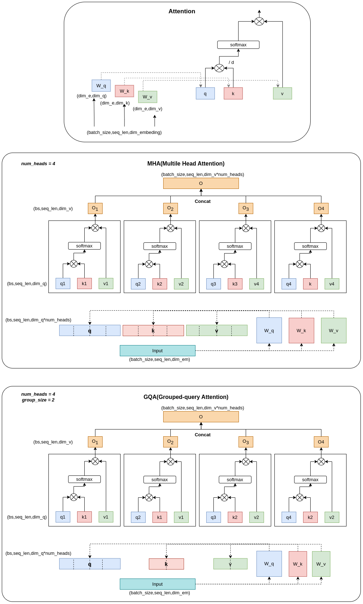

参考博客

[知乎llama2结构详解](https://zhuanlan.zhihu.com/p/649756898)

## Llama2

### 模型结构


Llama 2的模型结构与标准的Transformer Decoder结构基本一致，主要由32个 Transformer Block 组成
每一个 Transformer Block 主要包括一个Attention 和 FeedForwad

```python
class TransformerBlock(nn.Module):
    def __init__(self,):
        self.feedforward = FeedForward(...)
        self.attention = Attention(...)
    def forward(x):
        ...
```

与标准的Transfomer bolck的不同之处主要包括以下几点：

1. 前置的**RMSNorm**层
2. Q在与K相乘之前，先使用**RoPE**进行位置编码
3. **K V Cache**，并采用**Group Query Attention**
4. FeedForward层, SiLU函数

那么下文将结合具体的代码来展开聊一聊这些差异

#### RMSNorm

Transformer的Normalization层使用的是LayerNormlization层归一化对Tensor进行归一化

RMSNorm是LayerNormlization的变体，它省去了求均值的过程，也没有偏置  

$$RMSNorm(x) = \frac{x}{\sqrt{\frac{1}{N} \sum_{i=1}^{N}x_i^2 - \epsilon}} \gamma$$

其中 $\gamma$ 是可以学习的参数, $\epsilon$ 是给定的校准值

#### RoPE旋转位置编码

[RoFormer 原论文](https://arxiv.org/pdf/2104.09864)

[作者博客](https://spaces.ac.cn/archives/8265/comment-page-1)

[知乎博客](https://zhuanlan.zhihu.com/p/642884818)

- 旋转位置编码，使在计算attention的时候，也够考虑相对位置信息
- 增强模型的外推性，可以使得推理时输入的长度可以大于训练时的长度

Transformer中，我们在输入时，会经过一层position embedding 对每一个token进行位置编码

Llama中舍弃了位置编码，而是在每一次attention中，对q,k,进行旋转位置编码，这样能同时考虑在同一个序列中，两个token之间的相对位置信息

#### KV cache

[为什么需要kv cache](https://blog.csdn.net/ningyanggege/article/details/134564203)

通常在推理阶段，可以分为两个阶段，prefill 和 decode。

prefill阶段主要负责计算原始输入的q,k,v，进而得到第一个token

decode阶段。通过prefill阶段得到的第一个token拼接到原来的输入上，并以此作为新的输入，在进行q,k,v的计算，得到下一个token

在上面的过程中，其中每次进行一次decode,而在每一次的decode中都会得到一个新的q向量和,还有一部分新的k向量和v向量。但最后的输出结果新增的分量仅用到新增的q向量，还有全部的k和v,因此为了避免重新计算k,v,可以对kv进行cache,而对于q却不用cache前面的历史q，因为最后的输出只需要当前decode的q分量，见下图


#### GQA （分组查询注意力机制）

[MHA, MQA, GQA](https://mp.weixin.qq.com/s/_4OxoRLxhOcjGf0Q4Tvp2Q)



标准Attention模块，需要计算q,k,v通过attention的计算，最后通过一个output linear即可得到和输入相同形状的输出

Transformer中采用的是多头注意力，将计算出的q,k,v分成num_heads份，将输入也分成num_heads份，分别交给不同的attention模块计算，然后将不同attention模块计算出来的o给 concat 起来，最后做一个output linear得到和输入形状一样的输出

Llama2采用的是GQA,将若干个注意力头分为一组，同一个组内的attention共享k,v,计算上和形式上MHA区别不大，但减少了W_k,W_v还有q,v的参数,同时会带来一定损失，一个 trade off 的问题

#### 张量并行

llama2 的源码当中也采用了张量并行的做法，

对于ColumnParallel 的切割方式，需要完整的输入，最后将结果concat起来

对于RowParallel 的切割方式， 只需要部分的输入，最后将结果按位相加

通过上面两种对权重矩阵进行切割，可以将切割的部分放置到不同的gpu进行并行计算，提高整体的计算效率

