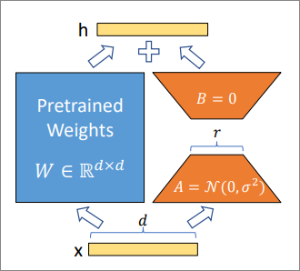

reference: [Lora](https://www.zhihu.com/tardis/zm/art/623543497?source_id=1003)

# Lora 

假设模型原始权重为 $W_0$ ， 微调模型的参数更新公式为 $W' = W_0 + \Delta W$ 

Lora 的主要思想就是使用两个低维度矩阵近似 $\Delta W$ ，即 $\Delta W = AB$ , 参数 $A$ 和参数 $B$ 的参数量小于 $W_0$ ，我们只需要在训练的时候更新 $A$ 和 $B$ 即可，最后在推理阶段只需要将原始矩阵 $W_0$ 与 $AB$ 相加即可

具体地，如果 $W \in  \R^{d \times k}$ , 那么 $A$ 矩阵的大小为 $d \times r$ , $B$ 矩阵的大小为 $ r \times k$ ，需要保证 $r(d+k) < d \times k$ , $r$ 需要设定。 $A$ 矩阵初始化使用高斯初始化，$B$ 初始化为0矩阵

