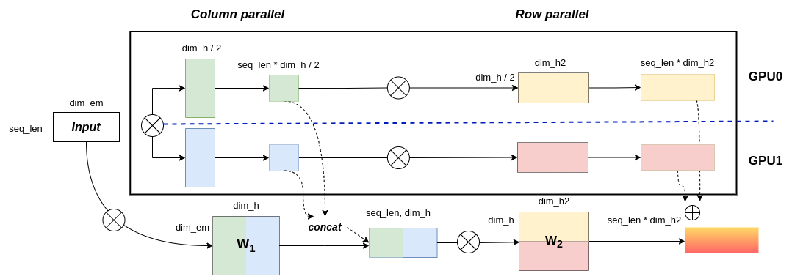

# 三大并行手段

## 数据并行

## 张量并行

主要有两种切割方式，对于一个矩阵有按列切分和按行切分

对于ColumnParallel 的切割方式，需要完整的输入，最后将结果concat起来

对于RowParallel 的切割方式， 只需要部分的输入，最后将结果按位相加

通过上面两种对权重矩阵进行切割，可以将切割的部分放置到不同的gpu进行并行计算，提高整体的计算效率

## 流水线并行
