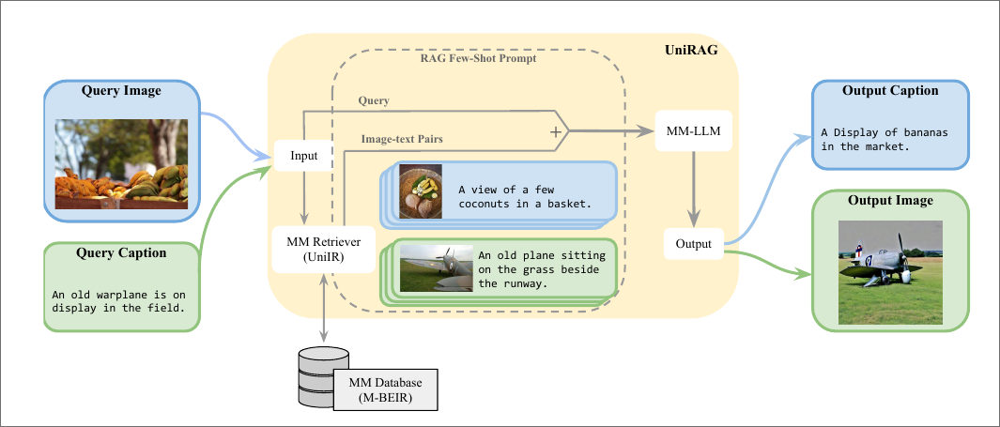

# UniRAG: Universal Retrieval Augmentation for Multi-Modal Large Language Models

- [arxiv论文连接](https://arxiv.org/abs/2405.10311)
- 代码未公布
- 单位: 滑铁卢大学
- 时间: v1 2024.5.16, v2 2024.10.20
- 状态: arxiv
- comments: 看起来好像是原本要投 ACL / EMNLP 的
- cite: 3

## Kimi总结

这篇论文介绍了一个名为UniRAG（Universal Retrieval Augmentation for Multi-Modal Large Language Models）的技术，旨在通过在推理过程中将相关检索到的信息作为少量样本（few-shot examples）添加到提示（prompts）中，来提升多模态大型语言模型（MM-LLMs）的输出保真度。UniRAG是一个插件式技术，可以与现有的MM-LLMs集成，通过检索增强（Retrieval Augmentation, RA）来引导生成过程。

主要贡献包括：

1. 提出了UniRAG技术，它结合了多模态检索器（如UniIR模型）和多模态语言模型，使用上下文检索增强（in-context RAG）。
2. 在图像描述（image captioning）和图像生成（image generation）任务上，使用五种多模态语言模型（包括开源和专有模型）广泛评估了UniRAG的有效性。
3. 在Fashion200k数据集上评估UniRAG，展示了其在特定领域应用中的有效性。

UniRAG采用两阶段的检索和生成工作流程：

- **检索阶段**：从多模态数据库中提取给定查询的最相关候选。
- **生成阶段**：多模态语言模型在零样本（zero-shot）或少量样本（few-shot）设置中生成所需输出。

实验使用了多种现成的专有和开源多模态语言模型，包括LLaVA、GPT-4o、Gemini-Pro用于图像描述，以及LaVIT和Emu2用于图像生成。评估主要使用MSCOCO数据集，结果显示，通过结合检索增强和多模态语言模型，与基线相比，在图像描述任务上平均提高了约9个百分点的SPICE评分，在图像生成任务上降低了25个单位的Fréchet Inception Distance（FID）评分。

论文还讨论了UniRAG的局限性，包括其使用受限于专有模型的许可和使用协议，以及评估仅限于英文数据集，对于非英语低资源语言的有效性尚未探索。此外，论文指出在实际应用中部署这种方法时，需要考虑基于事实、潜在危害、偏见等重要因素的候选排名，而不仅仅是依赖于相关性。最后，论文提出需要进一步研究检索增强在多模态推理中的泛化能力，例如使用实体中心评估数据集来更有效地展示检索增强的优势。

## 阅读笔记

动机:多模态的RAG检索

方法论:

1. 使用CLIP,BLIP作为检索器计算分数
2. 通过检索到的图像或者文本对作为样例，然后使用few-shot进行推理
